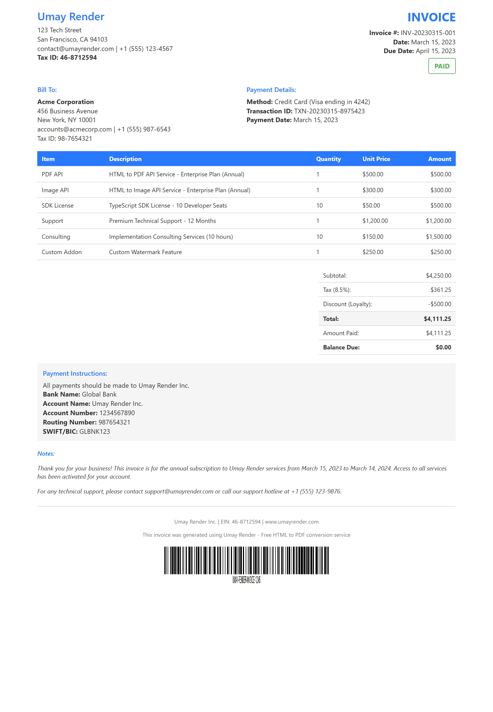

# Umay Render

[](https://www.npmjs.com/package/umay-render)
[](LICENSE)

**Umay Render** is a free, high-performance HTML to PDF and HTML to Image conversion service with an easy-to-use SDK. Unlike other expensive conversion services, Umay Render provides a completely free solution with enterprise-grade performance.

## Features

- ✅ **Free and Open Source** - No hidden costs or usage limits
- ✅ **High Performance** - Optimized for speed and reliability
- ✅ **Multiple Output Formats** - Generate PDFs and images (PNG)
- ✅ **Easy to Use SDK** - Simple API for both frontend and backend
- ✅ **Customizable Options** - Control page size, margins, quality, and more
- ✅ **Cross-Platform** - Works on all major platforms

## Installation

```bash
npm install umay-render
# or
yarn add umay-render
# or
pnpm add umay-render
```

## Quick Start

### Generate PDF from HTML

```javascript
// Client-side (Browser)
import { UmaySDK } from 'umay-render';

// Initialize the SDK
const client = new UmaySDK(); 
// Or with custom API URL (optional)
// const client = new UmaySDK({ 
//   API_URL: 'https://your-custom-api-url.com', // Optional: A default API URL is provided
//   TIMEOUT: 60000 // Optional: Default is 30000 (30 seconds)
// });

// Generate PDF from HTML
const pdfBuffer = await client.toPDF('<html><body><h1>Hello World</h1></body></html>', {
  format: 'A4',
  landscape: false,
  printBackground: true
});

// Download the PDF
client.downloadBlob(pdfBuffer, 'document.pdf', 'application/pdf');


// Server-side (Node.js)
import { UmaySDK } from 'umay-render';
import fs from 'fs';

// Initialize the SDK
const client = new UmaySDK();
// Or with custom API URL (optional)
// const client = new UmaySDK({ 
//   API_URL: 'https://your-custom-api-url.com', // Optional: A default API URL is provided
//   TIMEOUT: 60000 // Optional: Default is 30000 (30 seconds)
// });

// Generate PDF from HTML
const pdfBuffer = await client.toPDF('<html><body><h1>Hello World</h1></body></html>', {
  format: 'A4',
  landscape: false,
  printBackground: true
});

// Save the PDF to file
fs.writeFileSync('document.pdf', pdfBuffer);
```

### Generate Image from HTML

```javascript
// Client-side (Browser)
import { UmaySDK } from 'umay-render';

// Initialize the SDK
const client = new UmaySDK();
// Or with custom API URL (optional)
// const client = new UmaySDK({ 
//   API_URL: 'https://your-custom-api-url.com', // Optional: A default API URL is provided
//   TIMEOUT: 60000 // Optional: Default is 30000 (30 seconds)
// });

// Generate JPEG image from HTML
const imageBuffer = await client.toImage('<html><body><h1>Hello World</h1></body></html>', {
  type: 'jpeg',
  quality: 90,
  fullPage: true,
  viewport: {
    width: 1920,
    height: 1080,
    deviceScaleFactor: 2
  }
});

// Display or download the image
client.downloadBlob(imageBuffer, 'image.jpg', 'image/jpeg');
```

## Supported SDKs

| Language   | Status            | Package Name      |
|------------|-------------------|-------------------|
| TypeScript | ✅ Available      | umay-render       |
| JavaScript | ✅ Available      | umay-render       |
| Python     | 🔜 Coming Soon    | umay-render-py    |
| Go         | 🔜 Coming Soon    | umay-render-go    |
| Rust       | 🔜 Coming Soon    | umay-render-rs    |
| C#         | 🔜 Coming Soon    | UmayRender.NET    |
| Java       | 🔜 Coming Soon    | umay-render-java  |
| PHP        | 🔜 Coming Soon    | umay-render-php   |
| Ruby       | 🔜 Coming Soon    | umay-render-ruby  |

## Why Choose Umay Render?

### Cost-Effective Solution

Commercial HTML-to-PDF services can cost hundreds or thousands of dollars per month based on usage. Umay Render provides the same functionality completely free, saving you significant costs.

### Simple Integration

Whether you're working with frontend applications or backend services, Umay Render's SDK makes integration quick and painless. The same consistent API works across environments.

### Developer-Friendly

Our TypeScript SDK provides type safety and excellent IDE integration. Clear documentation and examples make it easy to get started.

### Versatile Output Options

Customize your PDFs and images with flexible options for page size, orientation, margins, quality, and more.

## Contributing

Contributions are welcome! Please feel free to submit a Pull Request.

## Examples

### Invoice Template

Convert HTML invoices to PDF or image formats with perfect formatting.

<details>
  <summary>View Invoice HTML Source</summary>

```html
<!DOCTYPE html>
<html lang="en">
  <head>
    <meta charset="UTF-8" />
    <meta name="viewport" content="width=device-width, initial-scale=1.0" />
    <title>Invoice</title>
    <style>
      @page {
        size: A4;
        margin: 0;
      }

      :root {
        --primary-color: #2979ff;
        --secondary-color: #f5f5f5;
        --text-color: #333333;
        --border-color: #dddddd;
      }

      body {
        font-family: "Segoe UI", Tahoma, Geneva, Verdana, sans-serif;
        margin: 0;
        padding: 0;
        color: var(--text-color);
        background-color: #fff;
        font-size: 12px;
        line-height: 1.4;
        -webkit-print-color-adjust: exact;
        print-color-adjust: exact;
      }

      .invoice-container {
        width: 210mm;
        min-height: 297mm;
        margin: 0 auto;
        padding: 15px;
        box-sizing: border-box;
      }

      /* Additional styles omitted for brevity */
    </style>
  </head>
  <body>
    <div class="invoice-container">
      <!-- Invoice content omitted for brevity -->
      <!-- See complete example in packages/umay-cli/examples/input/invoice.html -->
    </div>
  </body>
</html>
```
</details>

#### Output Examples

**PDF Output:**

[View Example PDF](./packages/umay-cli/examples/output/invoice.pdf)

**Image Output:**



#### CLI Command Used

```bash
# Generate PDF
umay render ./examples/input/invoice.html -t pdf -o ./examples/output/invoice.pdf

# Generate PNG Image
umay render ./examples/input/invoice.html -t image -o ./examples/output/invoice.png -w 900 -h 1300 -s 1 --full-page false
```

## License

This project is licensed under the MIT License - see the LICENSE file for details.

## Keywords

HTML to PDF, HTML to Image, PDF generation, Image generation, Web to PDF, Screenshot service, Puppeteer, PDF converter, Free PDF generator, Open source PDF, TypeScript SDK 